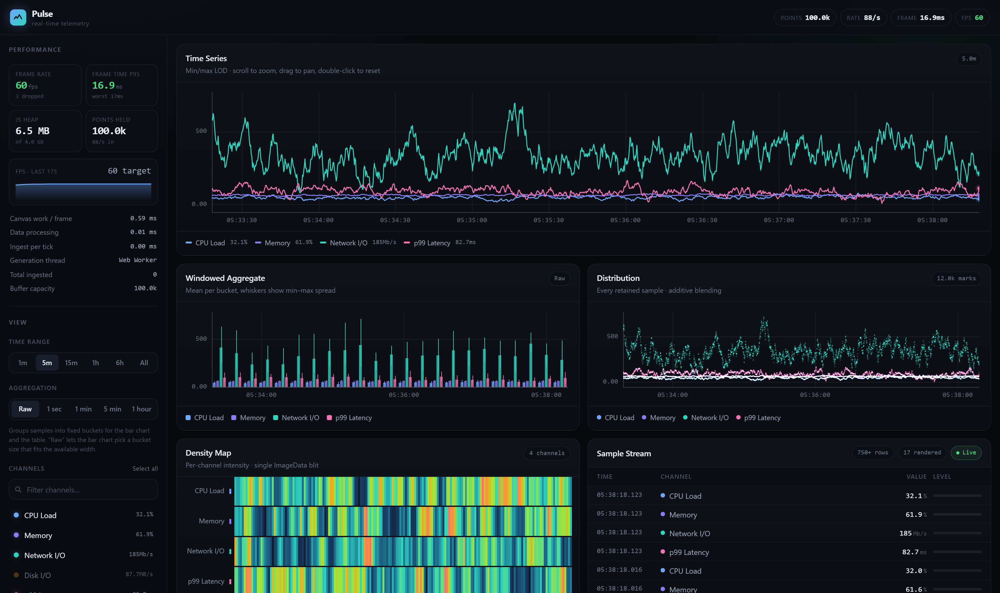
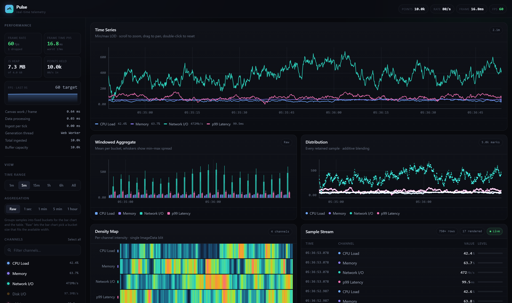
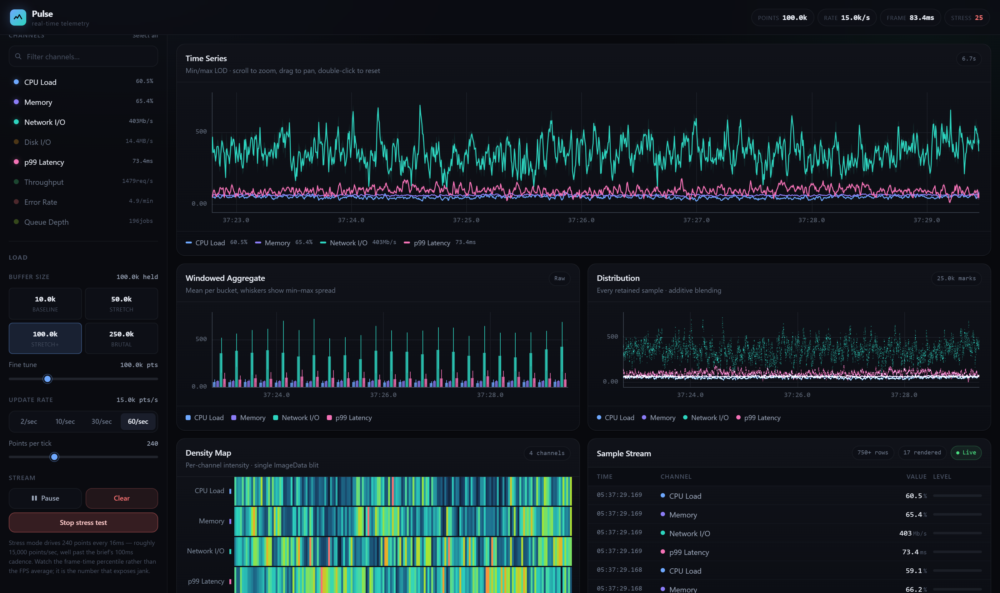
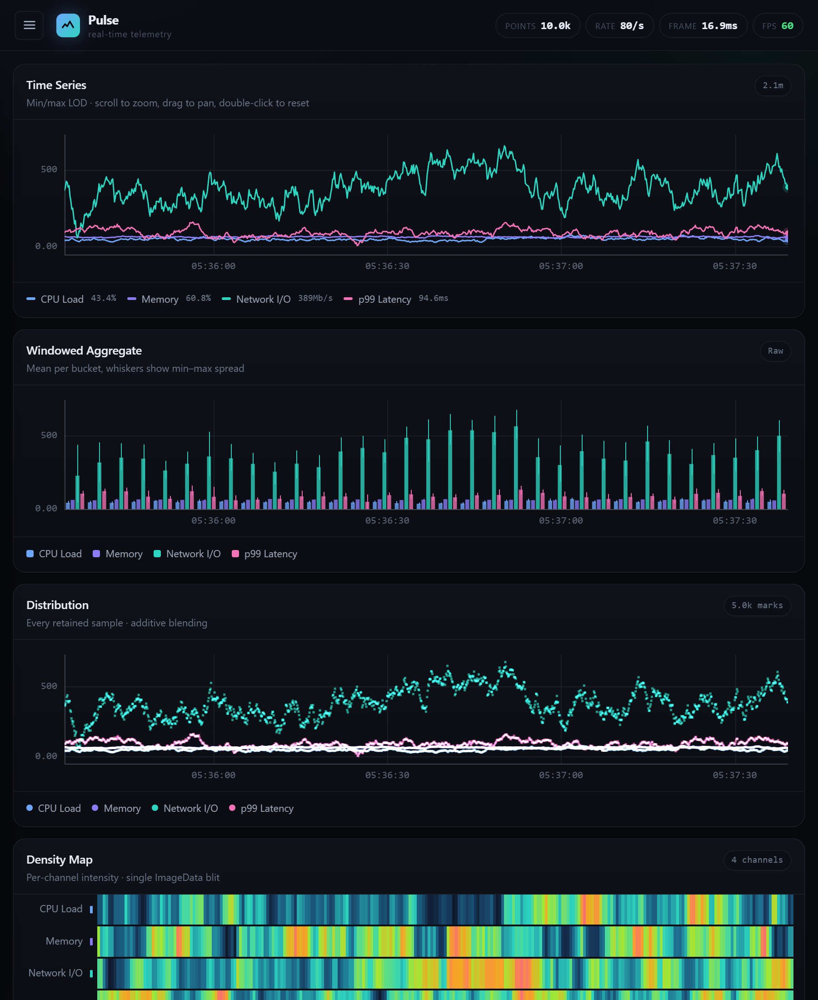
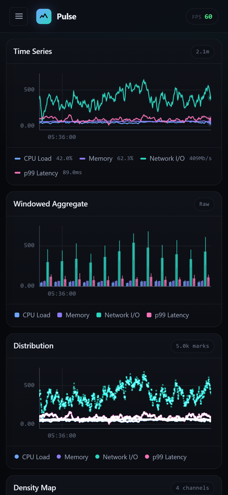

# Pulse — Real-time Telemetry Dashboard

**[→ Live demo](https://flam-assignment-beige.vercel.app/dashboard)**

A performance-critical data visualisation dashboard built with **Next.js 15 (App Router)** and
**TypeScript**. Eight live telemetry channels, up to **250,000 points retained**, rendered on raw
Canvas with an SVG interaction layer.

**No charting libraries.** No Chart.js, no D3, no plotting dependency of any kind — every axis, tick,
line, bar, mark and heatmap cell is drawn by code in this repository. The only runtime dependencies
are `next`, `react` and `react-dom`.



| Points held | FPS | Frame p95 | Frame max | JS heap |
| --- | --- | --- | --- | --- |
| 10,000 | **60** | 16.9 ms | 17.3 ms | 5.8 MB |
| 50,000 | **60** | 16.9 ms | 17.0 ms | 6.0 MB |
| 100,000 | **60** | 16.9 ms | 17.0 ms | 6.6 MB |
| 250,000 | **60** | 16.9 ms | 17.0 ms | 8.8 MB |

Measured on a production build via `npm run bench`. Retained heap over four minutes of live
streaming: **−0.14 MB**. Full methodology, and the story of a React update loop that leaked ~200,000
objects every three minutes without any benchmark noticing, in **[PERFORMANCE.md](PERFORMANCE.md)**.

---

## Quick start

```bash
npm install
npm run dev          # http://localhost:3000
```

Production build (what the performance numbers are measured against):

```bash
npm run build
npm start            # http://localhost:3000
```

The dashboard lives at **`/dashboard`**. The root path is a static landing page.

| Script | What it does |
| --- | --- |
| `npm run dev` | Dev server |
| `npm run build` | Production build |
| `npm start` | Serve the production build |
| `npm run typecheck` | `tsc --noEmit`, strict mode |
| `npm run lint` | ESLint (flat config) |
| `npm run bench` | Automated benchmark sweep — see below |
| `npm run analyze` | Bundle analysis report |

---

## What it does

**Four chart types, all hand-drawn on canvas**

- **Time series** — min/max level-of-detail line chart with an envelope band. Scroll to zoom
  (anchored on the cursor), drag to pan, double-click to reset. Crosshair with a live tooltip.
- **Windowed aggregate** — grouped bars over 1s / 1min / 5min / 1hour buckets, with min–max
  whiskers so an average never hides its spread.
- **Distribution** — every retained sample plotted, additively blended so overlap reads as density.
- **Density map** — channel × time intensity, per-row normalised, drawn via a single `ImageData`
  blit rather than thousands of `fillRect` calls.

**Everything else**

- **Real-time stream** at the spec'd 100ms cadence, generated in a Web Worker
- **Virtual scrolling** table over the live buffer — renders ~17 rows regardless of buffer size
- **Filtering** by channel, with a deferred search box
- **Time range** presets from 1 minute to all-time
- **Load controls** — buffer size (10k / 50k / 100k / 250k), update rate (2–60/sec), points per tick
- **Stress test mode** — 240 points every 16ms, roughly 15,000 points/second
- **Live performance HUD** — FPS, p95 frame time, dropped frames, JS heap, canvas time per frame,
  ingest time per tick, and which thread generation is running on
- **Responsive** — three-column desktop, stacked tablet, drawer-nav mobile

---

## Screenshots

| | |
| --- | --- |
| **Default — 10,000 points** <br>  | **Stress mode — 15,000 pts/sec** <br>  |
| **Tablet** <br>  | **Mobile** <br>  |

---

## Performance testing

### The automated sweep

```bash
npm run build
npm start &
npm run bench
```

`scripts/benchmark.mjs` drives a real Chrome against the production build, steps through every load
preset, runs the stress test, measures wheel-zoom latency under load, and checks heap retention
across forced garbage collections. It reads the dashboard's own HUD through `data-metric`
attributes.

It also refuses to report anything until it has confirmed the page is actually alive and holding
data — an earlier version cheerfully reported a rock-solid 60fps while the charts were rendering
nothing at all, which is the most useful thing it ever taught me.

Requires Chrome or Chromium installed locally (`playwright-core` uses your system browser rather
than downloading its own).

### By hand

1. Open `/dashboard` and watch the **FPS** and **frame time p95** tiles in the sidebar.
2. Click a **buffer size** preset. It fills immediately — the worker backfills plausible history
   rather than making you wait twenty minutes at 80 points/second.
3. Click **Run stress test** to jump to ~15,000 points/second.
4. Scroll-zoom and drag the time series chart while it's running.

**Read the p95, not the FPS average.** 59fps with one 180ms stall averages out fine and feels
terrible. The percentile is the number that tracks what you actually see.

### In DevTools

- **Performance panel** → record while stress mode runs. Long tasks are what matter.
- **Memory panel** → allocation timeline. The streaming path allocates nothing in steady state;
  the worker's batch buffers are recycled back over `postMessage`.
- **React DevTools Profiler** → the four charts should show *zero* renders while data streams. If
  they re-render on data arrival, something has regressed.

---

## Architecture

```
app/
├── dashboard/
│   ├── page.tsx          Server Component — generates the 10k-point seed dataset
│   ├── layout.tsx        Scopes the boundaries below to this segment
│   ├── loading.tsx       Streamed skeleton, mirrors the real grid geometry
│   └── error.tsx         Route-level error boundary
├── api/data/route.ts     Edge-runtime route handler
├── page.tsx              Static landing page (zero client JS)
├── layout.tsx            Root layout
└── globals.css           Design tokens

components/
├── charts/               LineChart, BarChart, ScatterPlot, Heatmap, ChartChrome
├── controls/             FilterPanel, TimeRangeSelector, LoadControls
├── ui/                   DataTable, PerformanceMonitor, HeaderStats
├── providers/            DataProvider — four split contexts
└── Dashboard.tsx         Shell

hooks/
├── useDataStream.ts      Worker bridge, ingest, backfill
├── useChartRenderer.ts   Canvas lifecycle + frame-loop membership
├── useChartInteraction.ts Zoom, pan, hover
├── usePerformanceMonitor.ts
└── useVirtualization.ts

lib/
├── seriesBuffer.ts       Columnar ring buffers + the LOD bucketing pass
├── dataGenerator.ts      Seeded mean-reverting random walks
├── renderScheduler.ts    One shared requestAnimationFrame loop
├── canvasUtils.ts        Scales, ticks, DPR, colour
├── performanceUtils.ts   Frame sampler, EMA, rAF throttle
├── perfBus.ts            Out-of-band timing mailbox
├── timeWindow.ts         Range resolution (called from the render loop)
├── chartConfig.ts        Static chart definitions
├── types.ts
└── workers/stream.worker.ts
```

Three ideas carry most of the weight. There is much more detail in
**[PERFORMANCE.md](PERFORMANCE.md)**.

**1. Data never becomes objects on the client.** Samples live in per-channel `Float64Array` /
`Float32Array` ring buffers. 100,000 points is ~1.2 MB and never moves; the same data as
`DataPoint[]` is ~12 MB and a major GC every few seconds. Ring buffer writes are O(1), so the
sliding window costs nothing.

**2. React is not in the render loop.** Data arriving never triggers a re-render. The canvases read
a version counter inside a single shared `requestAnimationFrame` pass. React only hears about new
data at 4Hz, and only for the components that genuinely display live text.

**3. Drawing cost tracks the viewport, not the dataset.** A 1200px plot has 1200 usable columns, so
the visible range collapses to one min/max pair per column. Keeping *both* extremes matters — with
plain decimation a single-sample spike blinks in and out as you pan.

---

## Next.js specifics

| Feature | Where | Why |
| --- | --- | --- |
| Server Component | `app/dashboard/page.tsx` | Generates the seed dataset so the first painted frame already has a full chart on it, instead of mounting empty and fetching |
| Client Components | charts, controls, table | Everything that touches canvas or pointer events |
| Route handler (edge) | `app/api/data/route.ts` | Pure arithmetic, no Node built-ins — nothing to gain from a Node lambda |
| `loading.tsx` | dashboard segment | Streamed skeleton matching the real grid, so the swap costs no layout shift |
| `error.tsx` | dashboard segment | Scoped to the segment, so a chart failure can't take down the landing page |
| ISR (`revalidate = 30`) | dashboard page | Seed data is cacheable; timestamps are rebased onto the client clock on hydration |
| `force-static` | landing page | Prerendered at build, ships no client JS beyond the router |
| Module worker | `lib/workers/` | Bundled by webpack as its own 3.2 KB chunk |
| No `next/font` | — | The system stack renders instantly with no network request and no layout shift |

**Bundle:** 123 kB First Load JS on `/dashboard` — well inside the 500 KB gzipped budget.

---

## Browser support

| Browser | Status |
| --- | --- |
| Chrome / Edge 111+ | Fully supported. `performance.memory` gives real heap readings here. |
| Firefox 121+ | Fully supported. The HUD reports typed-array size instead of heap and says so — `performance.memory` is Chromium-only. |
| Safari 16.4+ | Fully supported. |
| Older Safari / embedded webviews | Module workers may be unavailable; generation falls back to the main thread automatically and the HUD shows "main thread". |

Requires `ResizeObserver`, `IntersectionObserver`, `requestAnimationFrame` and typed arrays — all
baseline since 2020. `OffscreenCanvas` is *not* required.

Touch: charts use Pointer Events with `touch-action: none`, so drag-to-pan works on tablets. The
sidebar becomes a drawer below 960px.

---

## Notes on the assignment

A few requirements were interpreted rather than followed literally, and it's worth saying which:

- **"10,000+ points"** — the default buffer is exactly 10,000 to match the stated baseline. The
  presets go to 250,000, and the sweep in PERFORMANCE.md covers all four.
- **Web Workers** were listed as a bonus. They're on by default here, with a main-thread fallback,
  because the worker is also what makes instant backfill possible.
- **The stress test is deliberately past spec.** 15,000 points/second is ~190× the brief's cadence.
  It exists to find the breaking point, not to claim it's comfortable there — the numbers for it in
  PERFORMANCE.md are reported as measured.

---

Built by **Suryansh Gour**.
